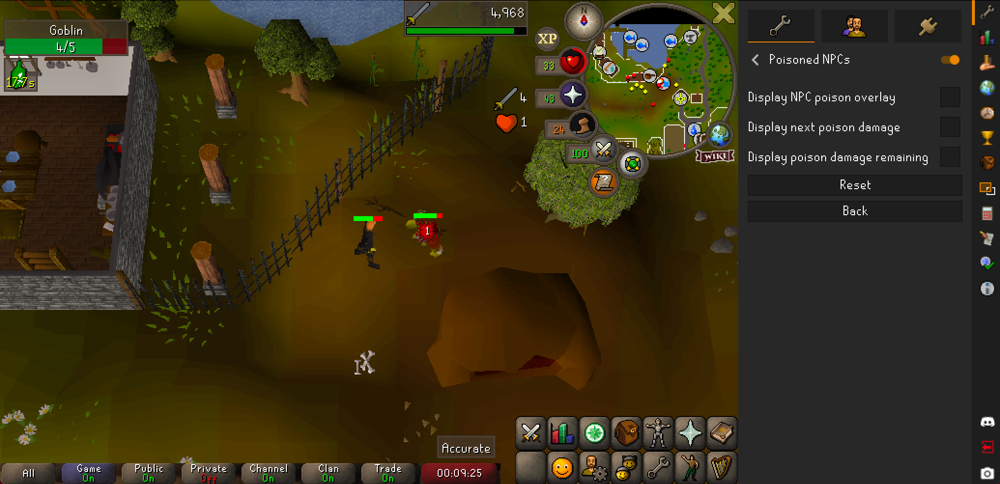
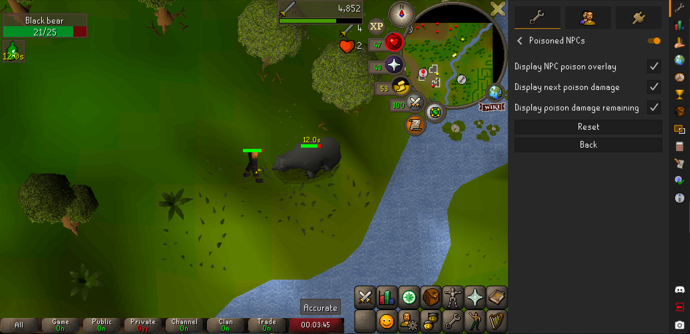
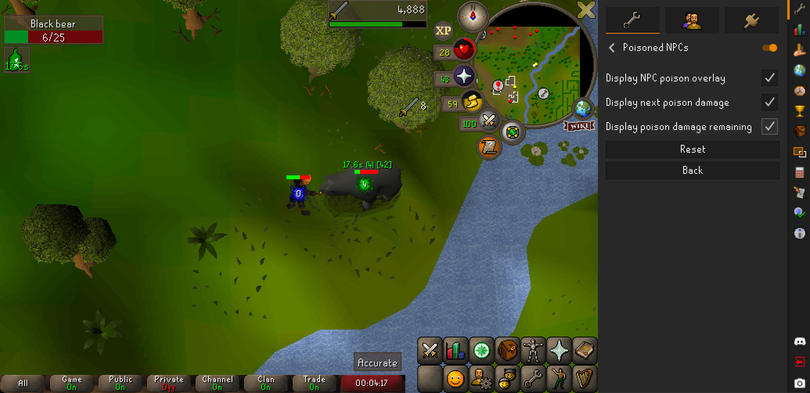
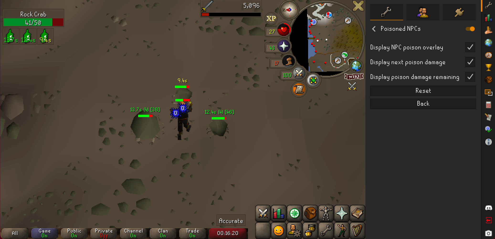

# Poisoned NPCs

When wielding poisoned weapons, will display timing and damage information for when poison will inflict damage on NPCs. Functions on NPCs only.

### Info Boxes

When hits have inflicted damage but no poison has yet been observed, an info box timer will appear counting down to the next possible time that poison _could_ begin to inflict damage. (Note that poison is not inflicted on every successful hit. See the wiki on [Poison](https://oldschool.runescape.wiki/w/Poison) for more description.) If the hit does not inflict damage, the timer will continue counting down from any subsequent hits which may inflict poison.

The timer to _possible_ poison is in **Yellow** text.

When _poisoned_, the timer is in **Green** text.

Hovering over the info box while the NPC is poisoned will display a tooltip with additional information:
* The amount of the next poison damage
* The total poison damage remaining before the poison expires
* The approximate remaining health of the NPC (if observable during non-poison combat)

### Overlay

The plugin's configuration contains the option to enable an overlay which, in addition to the info box, will display the timer above the affected NPC.

As with the info box, the pre-poisoned timer is displayed in **Yellow** while the poisoned timer is displayed in **Green**.

The timer is always displayed in the overlay. The overlay can also display the amount of the next poison hit and the total poison damage remaining, depending on the other configuration options.

### In multi-combat

In multi-combat, one info box will be displayed for each affected NPC. Each affected NPC will have its own overlay.

